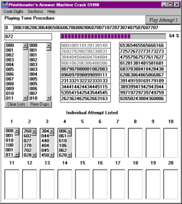



## Answer Machine Code Finder

### Description

Answer Machine Code Finder's purpose is to find the code to your answering machine. If you have lost the code, this program will narrow down the possible results. There are 3 digit codes and 2 digit codes to answering machines. 3 digit codes are seperated into sections to narrow down the results. Tones are played using WAV files corresponding to each number on the phone keypad.

This program demonstrates the use of:

Locking Listbox's,

Removing Duplicates in a list,

Progress Bar,

WAV Sound,

String Manipulation,

Number Sequencing from 0-99 and 000-999,

Code Searching

This code was not tried on a real answering machine. Please make sure that it is okay to try this out on an answering machine, within the US and international laws that may abide, before doing so. I have no knowledge of whether it is or is not.

As far as I know this code is one of a kind, I have never seen it done before. It might not be something you would use often, but *THINK* about it, it DOES have educational value so consider that most of all.
 
### More Info
 

             |
---                |---
**Submitted On**   |2001-07-07 22:35:12
**By**             |[Phishbowler](https://github.com/Planet-Source-Code/PSCIndex/blob/master/ByAuthor/phishbowler.md)
**Level**          |Intermediate
**User Rating**    |5.0 (20 globes from 4 users)
**Compatibility**  |VB 4\.0 \(16\-bit\), VB 4\.0 \(32\-bit\), VB 5\.0, VB 6\.0
**Category**       |[Complete Applications](https://github.com/Planet-Source-Code/PSCIndex/blob/master/ByCategory/complete-applications__1-27.md)
**World**          |[Visual Basic](https://github.com/Planet-Source-Code/PSCIndex/blob/master/ByWorld/visual-basic.md)
**Archive File**   |[Answer Mac22393772001\.zip](https://github.com/Planet-Source-Code/phishbowler-answer-machine-code-finder__1-24662/archive/master.zip)

